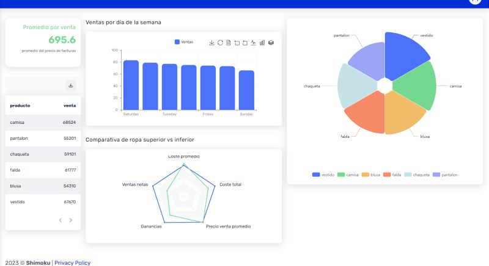

# Shimoku Dashboard SDK
Shimoku is a company that provides a dashboard SDK for creating data visualizations. This SDK can be used with Python to create interactive dashboards from data.

## Installation
To use the Shimoku SDK, you will need to install it using pip:

```
pip install -r requirements.txt
```
Alternatively, you can use pipenv to create a virtual environment for the project and install the required dependencies:

```
pipenv install
```
## Configuration
To configure your Shimoku dashboard, you will need to create a .env file in the root directory of your project. You can use the .env.example file as a template.

## Usage
To run your Shimoku dashboard, you can execute the following command:

```
python main.py
```
This will run a usage example, can see the results at https://shimoku.io/sign-in

## Data
To use your data with Shimoku, you will need to first load it into a Pandas DataFrame. You can then use the Shimoku SDK to create visualizations from this data.

## Contributing
If you would like to contribute to the Shimoku SDK, please fork the repository and submit a pull request.
